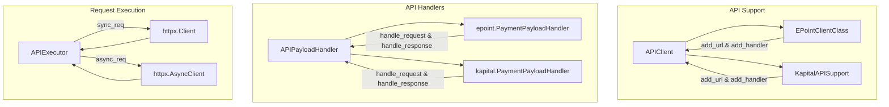

# Kod arxitekturası

## Bünovrə

İlk öncə sorğunun hansı prosesdən keçdiyinə nəzər salaq. Nəzərə alaq ki, hal hazırda KapitalBank supportu olmasa da, əlavə edilib ki, iki fərqli sistem bir yerdə necə mövcud olacağı daha yaxşı göstərilsin.

Bu strukturu nəzərdən keçisəniz, sorğunun hazırlanıb, göndərilib, cavabın parse və
validate olunmasını bu diaqramdan anlaya bilərsiniz.
