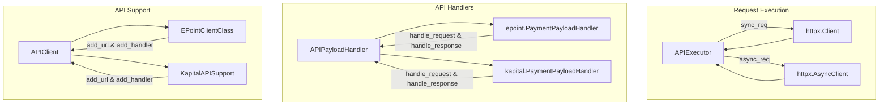
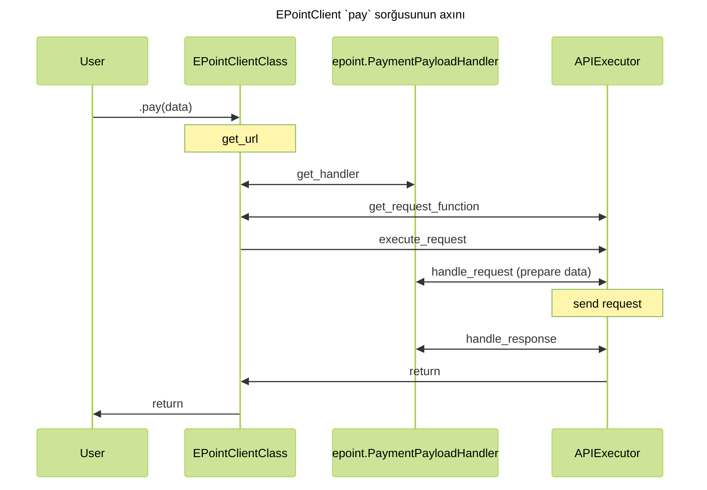

# Kod arxitekturası

## Bünovrə { #base }

İlk öncə sorğunun hansı prosesdən keçdiyinə nəzər salaq. Nəzərə alaq ki, hal hazırda KapitalBank supportu olmasa da, əlavə edilib ki, iki fərqli sistem bir yerdə necə mövcud olacağı daha yaxşı göstərilsin.



## Axın { #code-flow }

Bu strukturu nəzərdən keçisəniz, sorğunun hazırlanıb, göndərilib, cavabın parse və
validate olunmasını bu diaqramdan anlaya bilərsiniz.



## Yeni inteqrasiya { #new-integration }

Yeni inteqrasiya əlavə etmək istəyirsinizsə, zəhmət olmazsa [bu mərhələləri](./contributing.md) icra etdiyinizdən əmin olun. Kod yazmaq hissəyə gəldikdə isə, növbəti mərhələləri izləyin:

### 0. File strukturu { #file-structure }

Mövcud fayl strukturunu mimikləyə və ya sadəcə `make new-integration name=new-integration` kommandını icra edə bilərsiniz. Gözlənilən struktur budur:

```text
integrify
├── epoint
└── new-integration
    ├── __init__.py
    ├── client.py
    ├── env.py
    ├── handlers.py
    └── schemas
        ├── __init__.py
        ├── request.py
        └── response.py
```

### 1. Hazırlıq və constant-lar { #preparation-and-constants }

İlk öncə istifadə edəcəyiniz API-ləri bir enum constantları kimi yığın.
