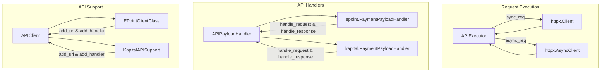
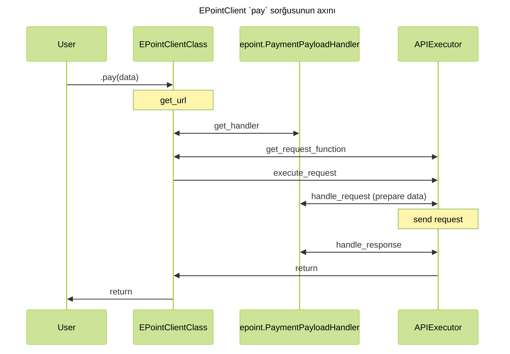

# Kod arxitekturası

## Bünovrə { #base }

İlk öncə sorğunun hansı prosesdən keçdiyinə nəzər salaq. Nəzərə alaq ki, hal hazırda KapitalBank supportu olmasa da, əlavə edilib ki, iki fərqli sistem bir yerdə necə mövcud olacağı daha yaxşı göstərilsin.



## Axın { #code-flow }

Bu strukturu nəzərdən keçisəniz, sorğunun hazırlanıb, göndərilib, cavabın parse və
validate olunmasını bu diaqramdan anlaya bilərsiniz.



## Yeni inteqrasiya { #new-integration }

Yeni inteqrasiya əlavə etmək istəyirsinizsə, zəhmət olmazsa [bu mərhələləri](./contributing.md) icra etdiyinizdən əmin olun. Kod yazmaq hissəyə gəldikdə isə, növbəti mərhələləri izləyin:

### 0. File strukturu { #file-structure }

Mövcud fayl strukturunu mimikləyə və ya sadəcə `make new-integration name=new_integration` kommandını icra edə bilərsiniz. Gözlənilən struktur budur:

```text

├── src
|   └── integrify
|       ├── __init__.py
|       ├── epoint
|       └── new_integration
|           ├── __init__.py
|           ├── client.py
|           ├── env.py
|           ├── handlers.py
|           └── schemas
|               ├── __init__.py
|               ├── request.py
|               └── response.py
└── tests
    ├── __init__.py
    ├── epoint
    └── new_integration
        ├── __init__.py
        ├── conftest.py
        └── mocks.py
```

Əlavə fayllar (məsələn, `utils.py`, `helpers.py`), və qovluqlar əlavə etmək olar, bu struktur sadəcə bünovrə fayllar üçün nəzərdə tutulub.

### 1. Hazırlıq və constant-lar { #preparation-and-constants }

İlk öncə istifadə edəcəyiniz API-ləri (endpoint) bir enum constantları kimi yığın. Əgər mühit dəyişənləri oxunmalıdırsa, onu da `env.py` faylında edin. Başqa ümumi və mühitlik bir hissə varsa, bir fayl atında toplanmalıdır.


### 2. Handler-lər { #handlers }

Növbəti olaraq, handler-ləri yazmağınız məsləhət görülür. Hər bir sorğu üçün, göndərilən (`schemas/request.py`) və qəbul edilən (`schemas/response.py`) datanın schema-sını yazın. 

???+ warning

    Request üçün nəzərdə tutulmuş schema-ların field-lərini user-dən aldığınız ardıcıllıqda yazın!
    Yəni əgər sizin funksiyanız bu formatdadırsa:

    ```python
    def pay(amount: Decimal, currency: str)
    ```

    onda bu request üçün schema:

    ```python
    class PaySchema(BaseModel):
        amount: Decimal
        currency: str
    ```

    olmalıdır. Əks halda, data qarışa bilər. Daha ətraflı anlamaq üçün, 
    `integrify.schemas.PayloadBaseModel`-ini araşdırın.

Request və response handler-lər hazır olduqdan sonra, hər API üçün bir handler yazıb, bu yazdığınız request və response schema-larını orda qeyd edin.

Nəzərə alın ki, əgər hər sorğu üçün, pre və ya post processing lazımdırsa, bunu schemalarda etmək əvəzinə, `pre_handle_payload` və `post_handle_payload` funksiyalarını override etməklə eyni nəticəni əldə edə bilərsiniz. Misal üçün, EPoint-in handler-lərini nəzərdən keçirin.

### 2. API Klient { #api-client }

Bütün handler-lər hazır olduqdan sonra, yeni APIClient class-ı yaradıb, hər şeyi register etməlisiniz. Bir inteqrasiya üçün bir endpoint belə register olunur:

```python
class NewIntegrationClientClass(APIClient):

    def __init__(self, sync: bool = True):
        super().__init__('NewIntegration', 'https://new-integration.com', None, sync)

        self.add_url('function1', env.API.API1, 'GET')
        self.add_handler('function1', API1PayloadHandler)
```

Əgər API-lərin çoxu eyni handler ilə idarə oluna bilirsə, onda `default_handler` arqumentini `None` əvəzinə, o handler-i qeyd edə bilərsiniz. Yəni, kod əgər spesifik API üçün handler-i tapmazsa, default handler-i istifadə edəcək.

???+ note

    Məsləhət görülür ki, faylın sonunda sync və async clientləri obyekt kimi yaradıb, onları `new_integration/__init__.py`
    faylına import edəsiniz. Bu user-in istifadəsini asanlaşdırır; hər dəfə class-ı yaratmaq yerinə hazır sizin obyekti 
    istifadə edir.

### 3. Type-hinted funksiyalar { #type-hinted-functions }

Bu hissənin kodun işləməsinə heç bir təsiri olmasa da, ən vacib hissələrdən biri hesab olunur. Nəzərə alın ki, bizim API klientlərin heç biri funksiya implement etmir; əvəzinə `__getattribute__` dunder metodu funksiyanın adından istifadə edərək, lazımı API və handler-ləri tapır. Ona görə də `function1` adlandırılması vacibdir, çünki mövcud olmayan funksiyanın adıdır.

Konstruktorda bütün API və handlerlər register olunduqdan sonra, `if TYPE_CHECKING:` şərti altında funksiyalar yazılmalıdır. Funksiyaların bütün arqumentləri type-hint-lənməli və funksiyanın özünün docstring-i olmağı şərtdir, dokumentasiya generate edəndə buradan "oxuyur".

Misal kod parçası:

`````python
class NewIntegrationClientClass(APIClient):

    def __init__(self, sync: bool = True):
        super().__init__('NewIntegration', 'https://new-integration.com', None, sync)

        self.add_url('function1', env.API.API1, 'GET')
        self.add_handler('function1', API1PayloadHandler)
    
    if TYPE_CHECKING:

        def function1(
            self,
            amount: Decimal,
            currency: str,
        ) -> APIResponse[API1ResponseSchema]:
            """API sorğusu

            **Endpoint:** */api/function-1*

            Example:
                ```python
                from integrify.new_integration import NewIntegrationRequest

                NewIntegrationRequest.function1(amount=100, currency='AZN')
                ```

            **Cavab formatı**: `API1PayloadHandler`

            Bu sorğunu haqqında məlumat.

            Args:
                amount: Ödəniş miqdarı. Numerik dəyər.
                currency: Məzənnə.
            """
    
NewIntegrationRequest = NewIntegrationClientClass(sync=True)
NewIntegrationAsyncRequest = NewIntegrationClientClass(sync=False)
`````

### 4. Testlər { #tests }

Testsiz, əlbəttə ki, olmaz) Test üçün, `pytest` istifadə olunur. `conftest.py` faylında, əsas fixture-ləri əlavə edin. `mocks.py` faylı isə, mock response fixture-ləri üçün nəzərdə tutulub. Ondan sonra, testlər üçün fayllar yaradıb, orada testlərinizi yazın. Test coverage-dən istifadə edərək, nəzərdən qaçırdığınız hissələri də görə bilərsiniz.

### 5. Dokumentasiya { #documentation }

Kodun development-ini və testini bitirdikdən sonra, dokumentasiya yazmaq lazım olur. İlk mərhələdəki əməliyyatı icra etmişdinizsə, sizin üçün avtomatik markdown faylları da yaradılmışdır. `about.md` faylında inteqrasiya haqqında ümumi məlumat, orijinal dokumentasiyanın linklərini paylaşmağınız məsləhət görülür. Funksionallıqların və dəstəyini yazdığınız endpointləri də qeyd edin. Kodunuz bütün API-ləri istifadə etməyə bilər; bu halda, sadəcə bunu dokumentasiyada bilidirin.

`api-reference.md` faylında isə, API reference-i generasiya edəcəksiniz. Bu formatı izləməlisiniz:

```markdown
::: integrify.new_integration.client.NewIntegrationClientClass
    handler: python
    options:
      members:
        - function1
        - function2
```

Docstring-lər yazmısınızsa, [mkdocstrings](https://mkdocstrings.github.io/) aləti özü hər şeyi generasiya edəcəkdir.

Dokumentasiyanı bitirdikdən sonra, `make docs` kommandası ilə dokumentasiyanın səhvsiz generasiya edildiyindən əmin olun. Dokumentasiyanı görmək üçün `make docs-serve` edin, və console-da qeyd olunan addressi browser-də açın (adətən `localhost:8000` olur).
